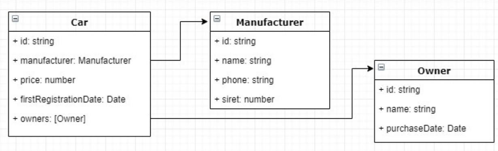

## Description

Test task using Typescript , Nest.js, TypeORM and using CQRS pattern

## Task Description
Implement a little backend microservice which aims to serve the cars data.		
This component will expose a REST api providing CRUD operations to fetch one or several cars, create, update and delete a car. Though this api, it will also be possible:
1.  Fetch only the manufacturer data for a given car (without any manufacturers dedicated APIs – i.e. only by using the car API)
2.  To trigger a process which will automatically remove the owners who bought their cars before the last 18 months and apply a discount of 20% to all cars having a date of first registration between 12 and 18 months.
    Also write several unit or e2e tests.

The car data model will be kept relatively simple:



The application has to be configured to run in a Docker container.

The language to use will be Typescript and the framework Nest.js. Use TypeORM and follow the CQRS pattern for services, especially for the second option of the task.

## Installation

```bash
$ npm install
```

## Running the app

```bash
# docker
$ docker compose up
```

## Test

```bash
# unit tests
$ npm run test

# e2e tests
$ npm run test:e2e

# test coverage
$ npm run test:cov
```